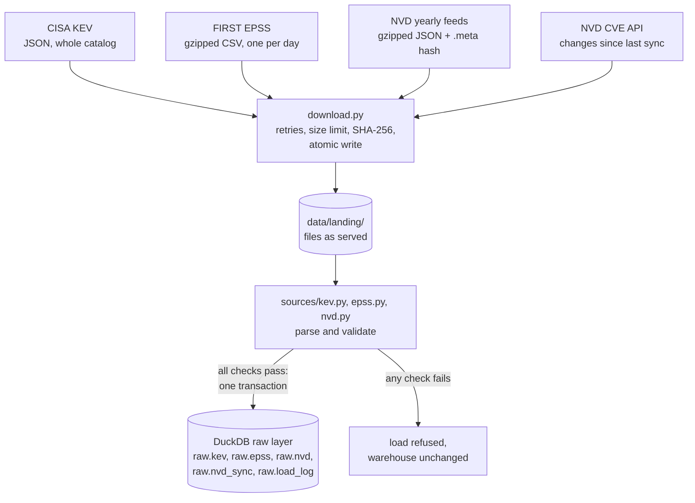

# vuln-priority-pipeline

[](https://github.com/JoaoPedro0305/vuln-priority-pipeline/actions/workflows/ci.yml)
[](https://github.com/JoaoPedro0305/vuln-priority-pipeline/actions/workflows/codeql.yml)
[](https://github.com/JoaoPedro0305/vuln-priority-pipeline/actions/workflows/live-sources.yml)

Daily pipeline that ranks CVEs by real-world exploitation risk (NVD + CISA KEV + EPSS),
backtests patching strategies and publishes a live dashboard.

## The question

Tens of thousands of CVEs are published every year and most teams can patch only a fraction of them.
Sorting by CVSS severity is the usual answer, but severity measures how bad an exploit *would* be,
not how likely one is. This project asks a measurable question:

> With a fixed patching budget, which prioritization rule catches the most vulnerabilities
> that end up exploited in the wild?

It combines three public sources:

| Source | What it says | Role here |
|---|---|---|
| [CISA KEV](https://www.cisa.gov/known-exploited-vulnerabilities-catalog) | CVEs with evidence of exploitation, and the date each was added | Ground truth: "was exploited" |
| [EPSS](https://www.first.org/epss/) (FIRST) | Daily probability of exploitation in the next 30 days, for every CVE | Predictive signal, with daily history since 2021 |
| [NVD](https://nvd.nist.gov/) | CVSS severity, affected products (CPE), weakness type (CWE) | Severity and context |

## Status

Built in stages, one pull request each:

- [x] **1. Ingestion of KEV and EPSS** into a DuckDB raw layer, validated before every load
- [x] **2. NVD ingestion**: full rebuild from the yearly feeds, daily increments from the API
- [ ] 3. dbt models (staging, marts) with data tests
- [ ] 4. Priority score and CISA SSVC decisions
- [ ] 5. EPSS history and the patching-strategy backtest
- [ ] 6. Dependencies of real repositories, matched through OSV.dev
- [ ] 7. Daily run and public dashboard on GitHub Pages
- [ ] 8. Automatic issue when a dependency enters KEV
- [ ] 9. OpenSSF Scorecard and v1.0 release

## How it works (so far)



- **ELT.** Files are saved exactly as served, then loaded into a raw layer that only types the
  columns. Cleaning and joining will happen in SQL (dbt), where every step can be tested and read.
- **Validate before loading.** KEV: header count matches the entries, CVE ids are well formed and
  unique, dates parse, and a catalog much smaller than the one loaded is refused. EPSS: no
  duplicates, scores and percentiles within [0, 1], a minimum row count. NVD: valid ids, dates and
  status on every CVE. A failed check leaves the warehouse as it was.
- **Three EPSS formats.** The daily file gained a `percentile` column in 2021 and a header line
  with the model version in February 2022; all three formats load, and each row keeps the model
  version that scored it.
- **Provenance.** `raw.load_log` records every load: source version, row count, final URL and the
  SHA-256 of the file.

### NVD: full and incremental

`vulnprio ingest nvd` decides on its own:

| Situation | What it does |
|---|---|
| First run, `--full`, or last sync over 90 days ago | Downloads the 25 yearly feeds (2002 to now, ~225 MB compressed), checks each against the SHA-256 in its `.meta` file and loads them one at a time. Feeds unchanged since their last load are skipped before downloading. |
| Last sync within 90 days | Asks the CVE API for everything modified since then, minus one day of overlap: a few requests instead of 225 MB. |

- **Watermark.** `raw.nvd_sync` records how far each complete sync covers (for feeds, the
  generation time of the oldest feed). The next incremental run starts from there.
- **Order-independent merge.** A stored CVE is only replaced by a version with an equal or later
  `lastModified`, so an older feed loaded after a newer API page changes nothing, and any load can
  be repeated safely. A CVE that changes while the API is being paged through arrives twice; the
  latest copy wins.
- **Rate limit.** Without a key the API allows 5 requests per 30 s, so requests are spaced 6 s
  apart; with the free `NVD_API_KEY` (sent as a header, never in the URL) 0.6 s. 403, 429 and 5xx
  answers are retried with backoff.
- **What is kept.** Scalar fields are typed; `metrics` (CVSS v2, v3.0, v3.1 and v4.0, from NVD and
  from the CNA), `weaknesses` and `references` stay as published JSON for dbt to interpret. The
  configurations tree, the largest field, is reduced to the distinct vulnerable CPE strings.
- **Why not the "modified" feed?** NVD documents a feed with the last 8 days of changes, but it
  answered 404 throughout development (its `.meta` file exists). The API covers the same need.

## Run it

Requires Python 3.11+.

```bash
python -m venv .venv
source .venv/bin/activate        # Windows: .venv\Scripts\activate
pip install -r requirements-dev.txt -e .

vulnprio ingest all              # KEV catalog, latest EPSS day, NVD (full first, then incremental)
vulnprio ingest epss --date 2023-03-07
vulnprio ingest nvd --years 2024 # only some yearly feeds
vulnprio ingest nvd --since 2026-10-01
vulnprio status
```

```text
source  version             rows  loaded at
epss    2026-10-09       384,993  2026-10-09 16:24 UTC
kev     2026.10.08         1,739  2026-10-09 16:24 UTC
```

Data goes to `data/` (ignored by git); `VULNPRIO_DATA_DIR` and `VULNPRIO_WAREHOUSE` move it.

## Quality and security of the repository itself

- `ci`: ruff (lint, including bandit security rules), 65 tests on Python 3.11 to 3.13, and
  `pip-audit` failing the build on any known vulnerability in the pinned dependencies.
- `codeql`: static analysis of the Python code and of the workflow files.
- `live sources`: weekly run against the real CISA, FIRST and NVD endpoints, so a format change
  is caught even when the code does not change.
- Exact dependency pins and GitHub Actions pinned by commit hash, both updated by Dependabot.
  Workflows run with a read-only token.

## License

MIT. KEV is published by CISA; EPSS scores are published by FIRST. This product uses data from
the NVD API but is not endorsed or certified by the NVD.
