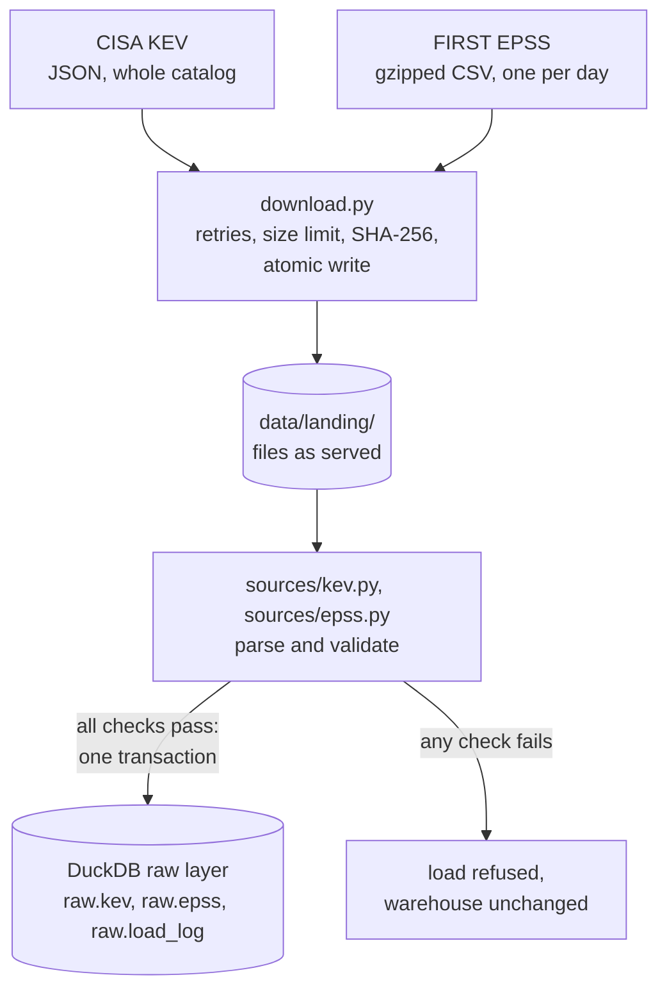

# vuln-priority-pipeline

[](https://github.com/JoaoPedro0305/vuln-priority-pipeline/actions/workflows/ci.yml)
[](https://github.com/JoaoPedro0305/vuln-priority-pipeline/actions/workflows/codeql.yml)
[](https://github.com/JoaoPedro0305/vuln-priority-pipeline/actions/workflows/live-sources.yml)

Daily pipeline that ranks CVEs by real-world exploitation risk (NVD + CISA KEV + EPSS),
backtests patching strategies and publishes a live dashboard.

## The question

Tens of thousands of CVEs are published every year and most teams can patch only a fraction of them.
Sorting by CVSS severity is the usual answer, but severity measures how bad an exploit *would* be,
not how likely one is. This project asks a measurable question:

> With a fixed patching budget, which prioritization rule catches the most vulnerabilities
> that end up exploited in the wild?

It combines three public sources:

| Source | What it says | Role here |
|---|---|---|
| [CISA KEV](https://www.cisa.gov/known-exploited-vulnerabilities-catalog) | CVEs with evidence of exploitation, and the date each was added | Ground truth: "was exploited" |
| [EPSS](https://www.first.org/epss/) (FIRST) | Daily probability of exploitation in the next 30 days, for every CVE | Predictive signal, with daily history since 2021 |
| [NVD](https://nvd.nist.gov/) | CVSS severity, affected products (CPE), weakness type (CWE) | Severity and context |

## Status

Built in stages, one pull request each:

- [x] **1. Ingestion of KEV and EPSS** into a DuckDB raw layer, validated before every load
- [ ] 2. Incremental NVD ingestion
- [ ] 3. dbt models (staging, marts) with data tests
- [ ] 4. Priority score and CISA SSVC decisions
- [ ] 5. EPSS history and the patching-strategy backtest
- [ ] 6. Dependencies of real repositories, matched through OSV.dev
- [ ] 7. Daily run and public dashboard on GitHub Pages
- [ ] 8. Automatic issue when a dependency enters KEV
- [ ] 9. OpenSSF Scorecard and v1.0 release

## How it works (so far)



- **ELT.** Files are saved exactly as served, then loaded into a raw layer that only types the
  columns. Cleaning and joining will happen in SQL (dbt), where every step can be tested and read.
- **Validate before loading.** KEV: header count matches the entries, CVE ids are well formed and
  unique, dates parse, and a catalog much smaller than the one loaded is refused. EPSS: no
  duplicates, scores and percentiles within [0, 1], a minimum row count. A failed check leaves
  the warehouse as it was.
- **Three EPSS formats.** The daily file gained a `percentile` column in 2021 and a header line
  with the model version in February 2022; all three formats load, and each row keeps the model
  version that scored it.
- **Provenance.** `raw.load_log` records every load: source version, row count, final URL and the
  SHA-256 of the file.

## Run it

Requires Python 3.11+.

```bash
python -m venv .venv
source .venv/bin/activate        # Windows: .venv\Scripts\activate
pip install -r requirements-dev.txt -e .

vulnprio ingest all              # current KEV catalog + latest EPSS day
vulnprio ingest epss --date 2023-03-07
vulnprio status
```

```text
source  version             rows  loaded at
epss    2026-10-09       384,993  2026-10-09 16:24 UTC
kev     2026.10.08         1,739  2026-10-09 16:24 UTC
```

Data goes to `data/` (ignored by git); `VULNPRIO_DATA_DIR` and `VULNPRIO_WAREHOUSE` move it.

## Quality and security of the repository itself

- `ci`: ruff (lint, including bandit security rules), 42 tests on Python 3.11 to 3.13, and
  `pip-audit` failing the build on any known vulnerability in the pinned dependencies.
- `codeql`: static analysis of the Python code and of the workflow files.
- `live sources`: weekly run against the real CISA and FIRST endpoints, so a format change is
  caught even when the code does not change.
- Exact dependency pins and GitHub Actions pinned by commit hash, both updated by Dependabot.
  Workflows run with a read-only token.

## License

MIT. KEV is published by CISA; EPSS scores are published by FIRST.
