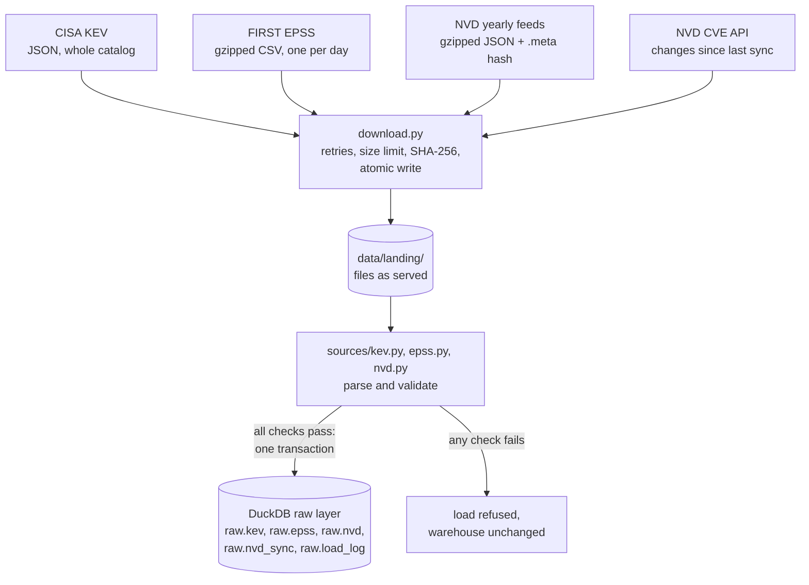
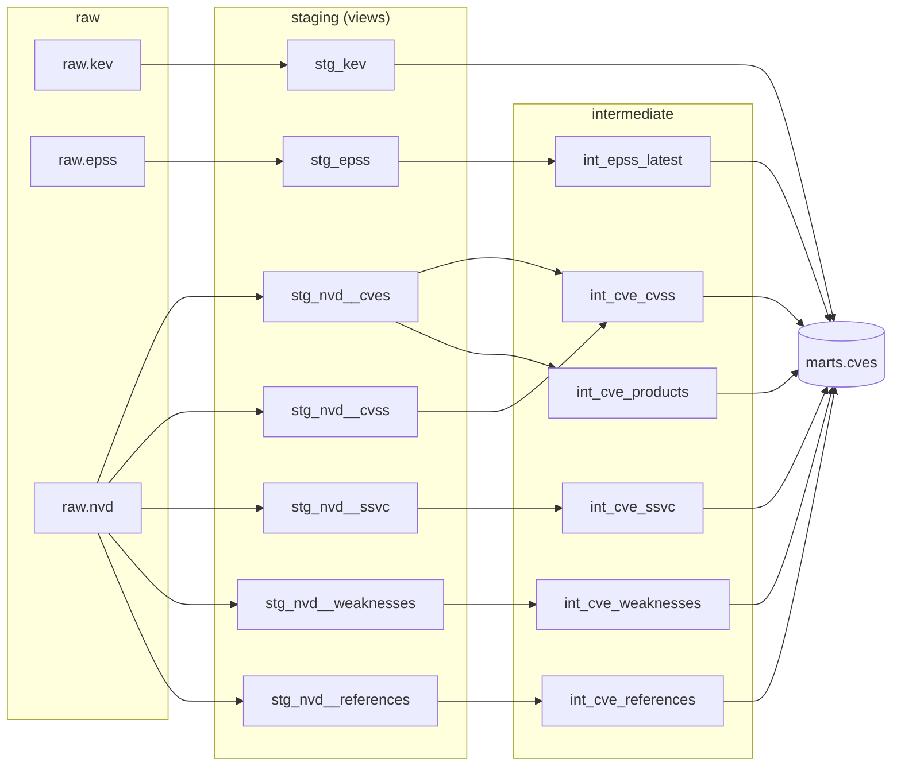

# vuln-priority-pipeline

[](https://github.com/JoaoPedro0305/vuln-priority-pipeline/actions/workflows/ci.yml)
[](https://github.com/JoaoPedro0305/vuln-priority-pipeline/actions/workflows/codeql.yml)
[](https://github.com/JoaoPedro0305/vuln-priority-pipeline/actions/workflows/live-sources.yml)

Daily pipeline that ranks CVEs by real-world exploitation risk (NVD + CISA KEV + EPSS),
backtests patching strategies and publishes a live dashboard.

## The question

Tens of thousands of CVEs are published every year and most teams can patch only a fraction of them.
Sorting by CVSS severity is the usual answer, but severity measures how bad an exploit *would* be,
not how likely one is. This project asks a measurable question:

> With a fixed patching budget, which prioritization rule catches the most vulnerabilities
> that end up exploited in the wild?

It combines three public sources:

| Source | What it says | Role here |
|---|---|---|
| [CISA KEV](https://www.cisa.gov/known-exploited-vulnerabilities-catalog) | CVEs with evidence of exploitation, and the date each was added | Ground truth: "was exploited" |
| [EPSS](https://www.first.org/epss/) (FIRST) | Daily probability of exploitation in the next 30 days, for every CVE | Predictive signal, with daily history since 2021 |
| [NVD](https://nvd.nist.gov/) | CVSS severity, affected products (CPE), weakness type (CWE) | Severity and context |

## Status

Built in stages, one pull request each:

- [x] **1. Ingestion of KEV and EPSS** into a DuckDB raw layer, validated before every load
- [x] **2. NVD ingestion**: full rebuild from the yearly feeds, daily increments from the API
- [x] **3. dbt models**: staging, intermediate and a `cves` mart, with data tests, a unit test and a contract
- [x] **4. Priority ranking** from CISA's SSVC decision table and the BOD 26-04 remediation timelines
- [ ] 5. EPSS history and the patching-strategy backtest
- [ ] 6. Dependencies of real repositories, matched through OSV.dev
- [ ] 7. Daily run and public dashboard on GitHub Pages
- [ ] 8. Automatic issue when a dependency enters KEV
- [ ] 9. OpenSSF Scorecard and v1.0 release

## How it works (so far)



- **ELT.** Files are saved exactly as served, then loaded into a raw layer that only types the
  columns. Cleaning and joining will happen in SQL (dbt), where every step can be tested and read.
- **Validate before loading.** KEV: header count matches the entries, CVE ids are well formed and
  unique, dates parse, and a catalog much smaller than the one loaded is refused. EPSS: no
  duplicates, scores and percentiles within [0, 1], a minimum row count. NVD: valid ids, dates and
  status on every CVE. A failed check leaves the warehouse as it was.
- **Three EPSS formats.** The daily file gained a `percentile` column in 2021 and a header line
  with the model version in February 2022; all three formats load, and each row keeps the model
  version that scored it.
- **Provenance.** `raw.load_log` records every load: source version, row count, final URL and the
  SHA-256 of the file.
- **Stalled transfers.** A connection that slows to a trickle never hits the read timeout, so
  each download is also held to a minimum speed (50 KB/s over 30 s windows) and started again
  up to 3 times. NVD feeds do this: one stalled at 15 KB/s, then took seconds on a new connection.

### NVD: full and incremental

`vulnprio ingest nvd` decides on its own:

| Situation | What it does |
|---|---|
| First run, `--full`, or last sync over 90 days ago | Downloads the 25 yearly feeds (2002 to now, ~225 MB compressed), checks each against the SHA-256 in its `.meta` file and loads them one at a time. Feeds unchanged since their last load are skipped before downloading. |
| Last sync within 90 days | Asks the CVE API for everything modified since then, minus one day of overlap: a few requests instead of 225 MB. |

- **Watermark.** `raw.nvd_sync` records how far each complete sync covers: the end of the API
  window, or after a feed rebuild the latest `lastModified` loaded. (Not the age of the oldest
  feed: NVD only regenerates a yearly feed when one of its CVEs changes, so the 2003 file can be
  weeks old and still current.) The next incremental run starts there, minus one day.
- **Why the overlap.** NVD sometimes makes a change visible in the API minutes after its
  `lastModified` time. In testing, a run caught 35 CVEs inside a window that a run 3 minutes
  earlier had already covered.
- **Order-independent merge.** A stored CVE is only replaced by a version with an equal or later
  `lastModified`, so an older feed loaded after a newer API page changes nothing, and any load can
  be repeated safely. A CVE that changes while the API is being paged through arrives twice; the
  latest copy wins.
- **Rate limit.** Without a key the API allows 5 requests per 30 s, so requests are spaced 6 s
  apart; with the free `NVD_API_KEY` (sent as a header, never in the URL) 0.6 s. 403, 429 and 5xx
  answers are retried with backoff.
- **What is kept.** Scalar fields are typed; `metrics` (CVSS v2, v3.0, v3.1 and v4.0, from NVD and
  from the CNA), `weaknesses` and `references` stay as published JSON for dbt to interpret. The
  configurations tree, the largest field, is reduced to the distinct vulnerable CPE strings.
- **Checked against the source.** After a full rebuild and two incremental runs the table held
  403,636 CVEs, exactly the `totalResults` the API reported at that moment. A full rebuild takes
  about 5 to 15 minutes depending on NVD's servers; a daily incremental run about 30 seconds.
- **Why not the "modified" feed?** NVD documents a feed with the last 8 days of changes, but it
  answered 404 throughout development (its `.meta` file exists). The API covers the same need.

## Transformation (dbt)

`vulnprio transform` runs `dbt build`: every model and its tests, in dependency order, so a model
whose tests fail stops everything built on it. The full run takes about a minute.



- **staging** unpacks NVD's nested JSON into one row per entry (CVSS score, SSVC assessment,
  weakness, reference) and trims and types everything else.
- **intermediate** holds the decisions, one per model. The main one, `int_cve_cvss`, picks one
  CVSS score per CVE: NVD first (an independent analyst), then the CNA that published the CVE,
  then anyone else; newer version on ties; and v3 as the headline score, the version most CVEs
  have and the one patching thresholds (7.0, 9.0) were defined on.
- **marts.cves** has one row per published CVE (385,178; 18,458 rejected ids left out): severity,
  CWE, products, KEV status, exploit references, CISA's SSVC assessment and the latest EPSS score.
  Its **contract** fails the build if a column disappears or changes type.
- **Tests**: 45 data tests (keys unique and present, accepted values, scores within range, every
  KEV CVE reaching the mart, CVSS v3 severity matching its score), source freshness thresholds,
  and **unit tests** of the CVSS choice and of the priority rules on hand-made rows. A pytest run builds the whole project
  on a small warehouse, so CI checks the SQL on every pull request.

### What the data already shows

**Severity depends on who you ask.** Of 58,491 CVEs scored with CVSS 3.1 by both NVD and the CNA,
75% got different scores, 58% differ by a full point or more, and 30% land on opposite sides of
the 7.0 "high" line.

**NVD now scores a minority of new CVEs.** Share of each year's CVEs whose v3 score comes from NVD:

| Published | CVEs | Scored by NVD | Only by the CNA | Only by others (e.g. CISA) | No v3 score |
|---|---:|---:|---:|---:|---:|
| 2022 | 25,073 | 92% | 8% | 0% | 0% |
| 2023 | 28,816 | 92% | 8% | 0% | 0% |
| 2024 | 39,953 | 58% | 28% | 14% | 1% |
| 2025 | 48,152 | 37% | 47% | 16% | 6% |
| 2026 (to Oct.) | 76,299 | 20% | 64% | 16% | 10% |

That is why the score keeps a `cvss3_provider` column, and why severity alone is a shaky basis for
prioritization.

## Priority ranking

`marts.cve_priorities` ranks every published CVE with CISA's own decision tables, copied as dbt
seeds from the SSVC project of CERT/CC (pinned to a commit):

| Table | Inputs | Output |
|---|---|---|
| SSVC, CISA Coordinator 2.0.3 | exploitation, automatable, technical impact, mission impact | track, track\*, attend, act |
| BOD 26-04 timelines | in KEV, publicly exposed, automatable, technical impact | fix in 3 days (+ forensic check), 3, 14 or 60 days, or on upgrade |

`priority_rank` sorts by timeline, then SSVC decision, then EPSS, then CVSS, and
`priority_reason` says why in words:

```text
$ vulnprio top --limit 3
   rank  cve             product                           fix within        ssvc    why
      1  CVE-2024-3400   Palo Alto Networks PAN-OS         3 days+forensics  act     exploited in the wild (KEV, ransomware); automatable; total control; EPSS 99.9%; CVSS 10.0
      2  CVE-2021-44228  Apache Log4j2                     3 days+forensics  act     exploited in the wild (KEV, ransomware); automatable; total control; EPSS 99.9%; CVSS 10.0
      3  CVE-2019-11510  Ivanti Pulse Connect Secure       3 days+forensics  act     exploited in the wild (KEV, ransomware); automatable; total control; EPSS 99.9%; CVSS 10.0
```

**Where the inputs come from.** CISA assessed about half of all CVEs (197k). For the rest the
inputs are derived, and the derivation was checked against CISA's answers on the 190k CVEs that
have both:

| Input | Derived from | Agrees with CISA |
|---|---|---:|
| Automatable | CVSS vector: network, low complexity, no privileges, no user interaction | 92% |
| Technical impact | CVSS vector: high confidentiality and integrity impact ("total control") | 90% |
| Exploitation | in KEV = active; NVD reference tagged "Exploit" = proof of concept | 88% |

Exploitation takes the **strongest** evidence available: CISA's assessment can predate the CVE's
addition to KEV. CVEs with no vector at all (3,357) default to "not automatable, partial impact"
and say so in `automatable_source = 'unknown'`.

**Organisation inputs.** Mission impact and internet exposure describe your systems, not the
vulnerability, so they are dbt variables (defaults: medium, exposed):

```bash
vulnprio transform --mission-impact high --publicly-exposed no
```

**What it shows.** At medium mission impact, SSVC says *act* or *attend* almost only for
vulnerabilities already exploited (1,600 of 1,605 are in KEV): it waits for evidence. The other
~384,000 CVEs are *track* or *track\**, and within those the order comes from EPSS. Whether that
order is any good is the question of the next stage.

> **Caution for the backtest.** This ranking uses today's KEV, which is also what "exploited" will
> mean in the backtest. Evaluating it on the past requires the KEV and EPSS of each past date,
> not today's, or the result is circular.

## Run it

Requires Python 3.11+.

```bash
python -m venv .venv
source .venv/bin/activate        # Windows: .venv\Scripts\activate
pip install -r requirements-dev.txt -e .

vulnprio ingest all              # KEV catalog, latest EPSS day, NVD (full first, then incremental)
vulnprio ingest epss --date 2023-03-07
vulnprio ingest nvd --years 2024 # only some yearly feeds
vulnprio ingest nvd --since 2026-10-01
vulnprio transform               # dbt build: models + tests
vulnprio transform --select marts
vulnprio top --vendor apache --since 2025-01-01
vulnprio status
```

```text
source  version             rows  loaded at
epss    2026-10-09       384,993  2026-10-09 16:24 UTC
kev     2026.10.08         1,739  2026-10-09 16:24 UTC
```

Data goes to `data/` (ignored by git); `VULNPRIO_DATA_DIR` and `VULNPRIO_WAREHOUSE` move it.

## Quality and security of the repository itself

- `ci`: ruff (lint, including bandit security rules), 75 tests on Python 3.11 to 3.13 (several build the dbt project), and
  `pip-audit` failing the build on any known vulnerability in the pinned dependencies.
- `codeql`: static analysis of the Python code and of the workflow files.
- `live sources`: weekly run against the real CISA, FIRST and NVD endpoints, so a format change
  is caught even when the code does not change.
- Exact dependency pins and GitHub Actions pinned by commit hash, both updated by Dependabot.
  Workflows run with a read-only token.

## License

MIT. KEV is published by CISA; EPSS scores are published by FIRST. This product uses data from
the NVD API but is not endorsed or certified by the NVD.
